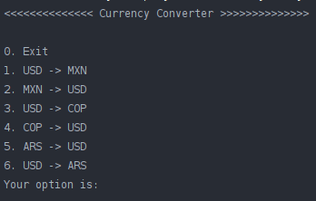
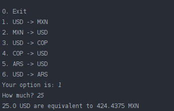

# Mini Currency Conversor App

This app was developer using the Java language to demonstrate the use of these topics:

- API connection and consumption of [currency exchange API](https://www.exchangerate-api.com/docs/java-currency-api) to convert from two exchanges.
- Basic user interaction using the terminal

## Usage

The user is presented with a menu from which they can choose one of these options to be processed.

<figure>
  
  <figcaption><i>Figure 1 - User menu</i></figcaption>
</figure>

After the options is given, the user enters the the target amount convert, which in turn is processed by the API

<figure>
  
  <figcaption><i>Figure 2 - Result of the conversion</i></figcaption>
</figure>
